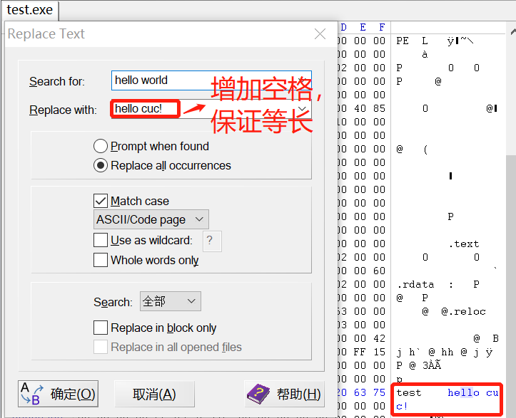

## exp1

**题目要求**: 编写一个release版本的 hello world 程序。通过修改程序可执行文件的方式（不是修改源代码），使得程序运行后显示的内容不为`hello world`，变成 `hello cuc！`（hint：一定要在编译选项中将调试信息相关的编译连接选项去掉，否则程序体积会比较大，而且存在很多“干扰”信息。)


### 0x00 编写实验使用的 C 语言程序

实验源代码如下:

```C
#include <windows.h> 
int main()
{
	MessageBoxA(NULL,"hello world","test",NULL);
}
```

使用头文件 `<windows.h>`，依赖 `user32.lib` 库，`/SUBSYSTEM` 指定 `windows`。在 VS自带的 win32 命令提示符中输入以下指令进行编译链接:

```
# '/c'   Compiles without linking.
# '/O1'  Creates small code.
cl /c /O1 test.c


# '/ALIGN'		   Specifies the alignment of each section.
# '/ENTRY'		   Sets the starting address.
# '/NODEFAULTLIB'  Ignores all (or the specified) default libraries when external references are resolved.
# '/NOLOGO'		   Suppresses the startup banner.
# '/OUT'		   Specifies the output file name.
# '/SUBSYSTEM'	   Tells the operating system how to run the .exe file.
link /nologo /ENTRY:main /NODEFAULTLIB /SUBSYSTEM:WINDOWS /ALIGN:16 test.obj user32.lib
```


查看产生的 `.exe` 文件:


### 0x01 更改显示字符串

直接使用 `WinHex` 打开 `test.exe`文件，使用快捷键 `ctrl+h`替换文本：



直接双击运行修改后的 `exe`文件，结果如下:

​	 