## Edit Notepad

**实验要求：**在notepad（32位64位均可）中，输入一段文字。然后使用调试器，在内存中修改这段文字。使得没有在界面操作notepad的修改文字的情况下。notepad中显示的文字变化。(提示，在调试器中定位控件缓存的内存地址，可以用搜索、逆向、消息截获分析、API截获分析等方法。)


**实验环境**：`Win10` 下 32 位的 `notepad` 


**实验工具**：`OllyICE` 、`windbg `


### 0x00 查找堆

首先打开 `notepad.exe` ，在 `notepad` 中输入`hello world!`, `od`中选择 `attach` 附加到 `notepad.exe` 进程。    

`notepad` 显示的字符串，因为事先长度不可知，因此猜测是存在内存堆中。首先要找到内存堆被分配的地址。和内存堆相关的函数有 `HeapCreate` 、`HeapAlloc` 和 `HeapFree`，在 `od` 中 `search for -> Name in current module`，使用字符串匹配搜索，并没有找到以上的三个函数，但是有替换的函数：

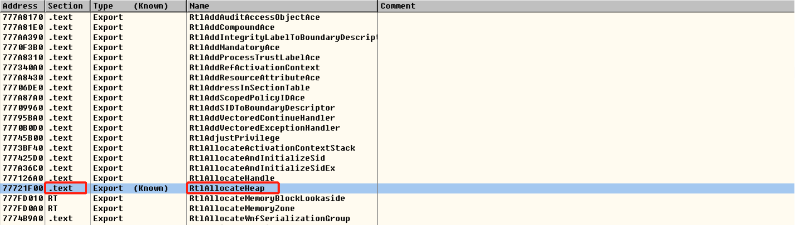

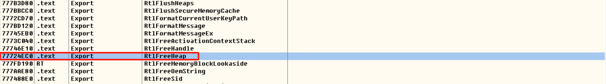

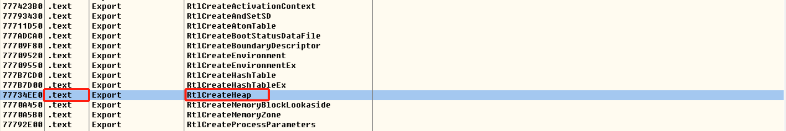

显然，`notepad.exe` 的 `.text` 段用 `RtlCreateHeap` 、`RtlAllocateHeap` 、`RtlFreeHeap` 替换了上面三个函数。只要监视函数即可得到 `heap` 的地址。

在 `MSDN` 中找到 `RtlAllocateHeap` 函数原型：

```
NTSYSAPI PVOID RtlAllocateHeap(
  PVOID  HeapHandle,
  ULONG  Flags,
  SIZE_T Size
);
```

其中 `PVOID HeapHandle` 参数的解释如下：

```
Handle for a private heap from which the memory will be allocated. This parameter is a handle returned from a successful call to RtlCreateHeap.
```

其中 `RtlCreateHeap` 如果创建成功则会返回新建堆的地址，**i.e.** 只要监视调用函数时传递的最后一个参数（入栈反向）即可得到堆地址。同时 ，上文中的 `private heap` 为创建的堆的**特征**，可以作为寻找堆的依据。

因此，在上面的 `RtlAllocateHeap ` 处 `F2` 下断，`Ctrl - F9` 运行至返回，得到的堆地址如下：

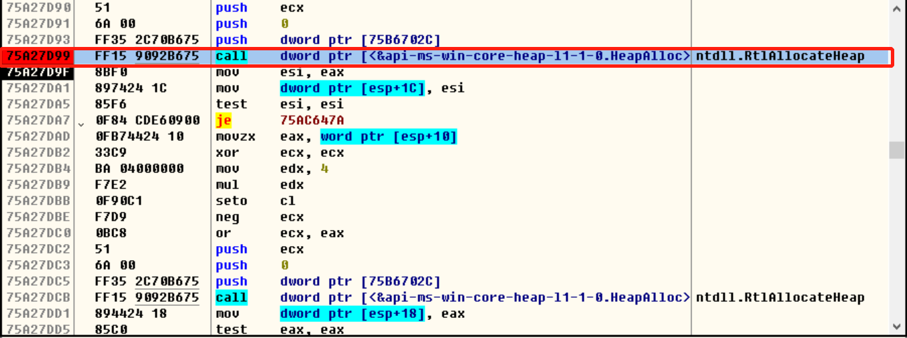

( 上面一个调试失败了，下面的图可能地址不一样...)


堆地址为 `03330000`，`ALT - M` 看一下内存映射：

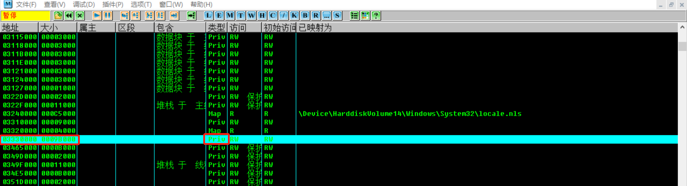

成功查找到堆的内存位置。


### 0x01 修改数据

进入到 `0x03330000` 地址处，因为堆区块前面的内容大致就是：

- 段表索引 `Segment List`
- 虚表索引 `Virtual Allocation list`
- 空表使用标识 `Freelist usage bitmap`
- 空表索引区 

直接查看 偏移`0x178` 处空表索引区( 这里的思路是错误的，因为 `hello world!` 已经作为字符串写入，该块内存应该已经从空闲双向链表中删去)：

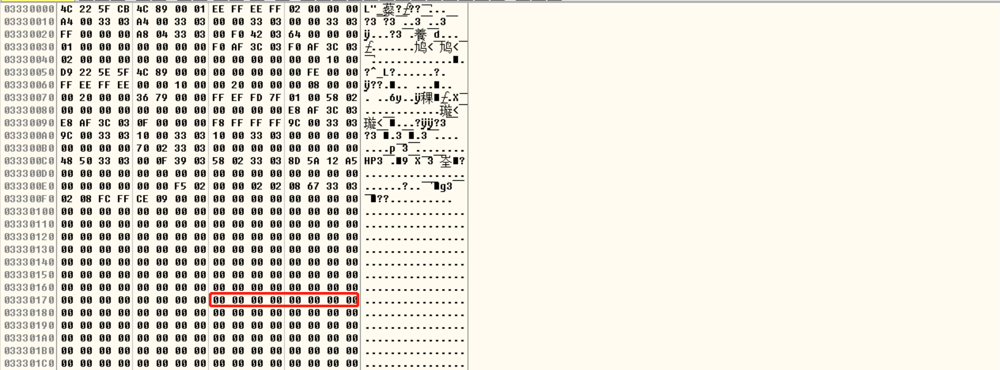

考虑到堆的大小有限，因此直接使用字符串搜索功能查找 `hello world!`：

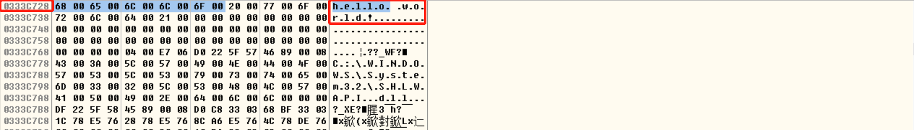

看到在偏移 `0xc728` 处查找到字符串，直接编辑修改为 `hello cuc!`：

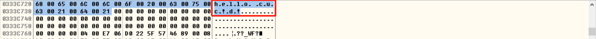

数据修改完毕。


### 0x02 运行

修改完数据，`ALT - C` 跳转，然后使用 `CTRL - F8` 逐条执行，结果如下：

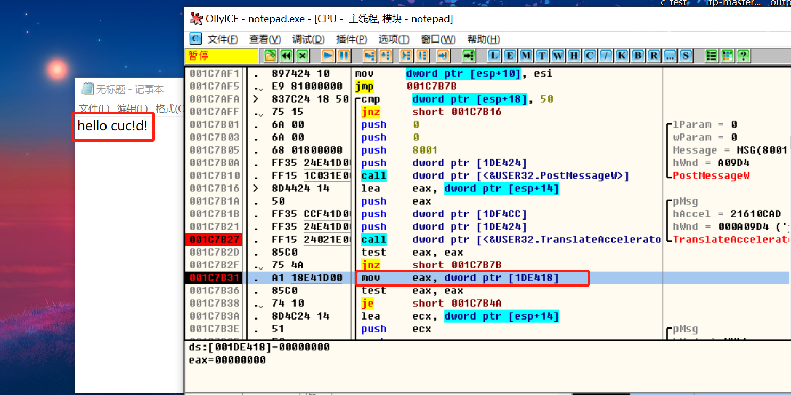

可能是经过了 `PostMessageW` 和 `TranslateAcceleratorw` 之后数据发生了变化。


### 0x03 实验时的问题

[1].  `RtlAllocateHeap` 下断之后别用 `F4` 运行至光标处，很容易报错。

[2].  调试时经常遇到 `...set single step flag(bit T in EFL)...` 这个弹窗，只要在弹窗的地方的下一条语句处下断 或 `F4` ，即可解决。

[3]. 改完字符串后一定不要使用 `F9` 运行，进程运行很快，并且会无故退出，观察不到实验结果。可以尝试在 `PostMessage` 和 `TranslateAcceleratorw` 处下断 `F9` 运行。

[4]. `od` 调试的失败率很高，大概 100 次 成功 2 次，可能是因为本人使用 `od` 不熟练。


### 0x04 更换工具    

使用 `WinDbg` 尝试实验。首先还是查找堆的位置：

```windbg
# 列出所有堆
!heap -a
```

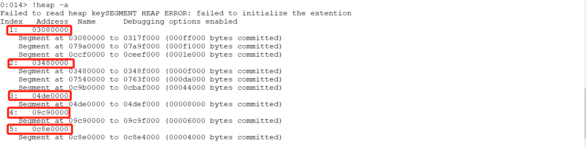

如图有五个堆，之前的 `od` 调试的时候只看到了两个 ... 直接搜索到最后一个堆：

```
# 查找字符串 "hello world!"
# 0c8e4000 是最后一个堆中最后一个 segment 结束
# 03080000 是第一个堆第一个 segment 的起始
s -u 03080000 (0c8e4000-03080000) "hello world!"
```

搜索结果：

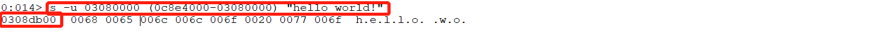

```
# 显示 0308db00 处内容
db 0308db00

# 修改地址处的内容
ezu 0308db00 "hello cuc!!!"

# 显示 0308db00 处内容
db 0308db00

# 运行
g
```

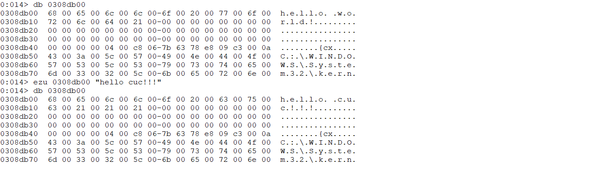

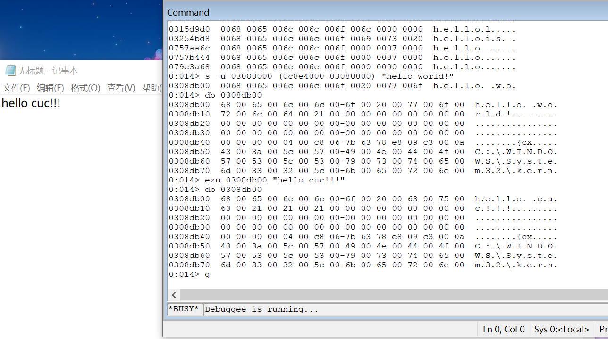

实验成功。暂时以个人的观点，简单对比一下 `od` 和 `WinDbg` ：

[1].  查阅资料得知，`od` 只能调 32 位程序（不知真假...）

[2]. `od` 调试多线程要手动切换。

[3]. `Windbg` 实验成功率高。

[4]. `od` 的实验窗口更清晰，不需要手动输入指令查询。

[5]. `Windbg` 命令查堆很方便。( **听说** `od` 也有堆查询的插件 ) 