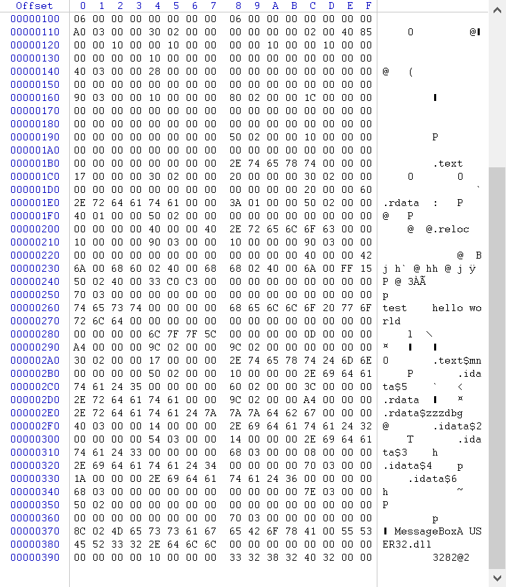
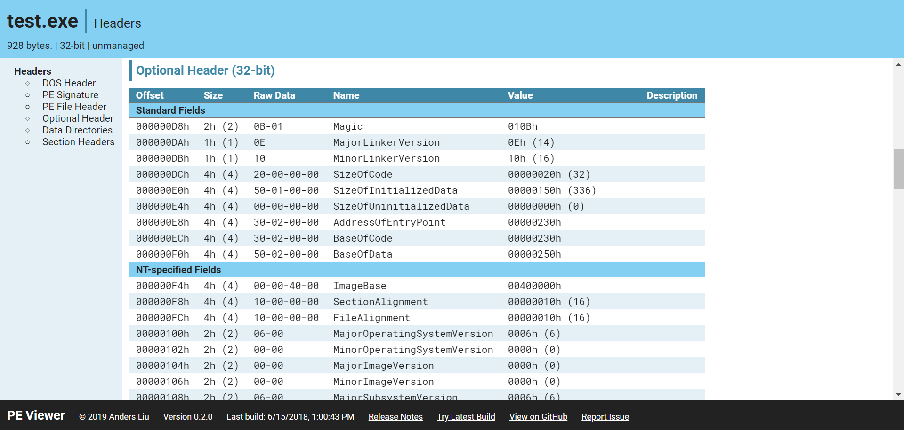
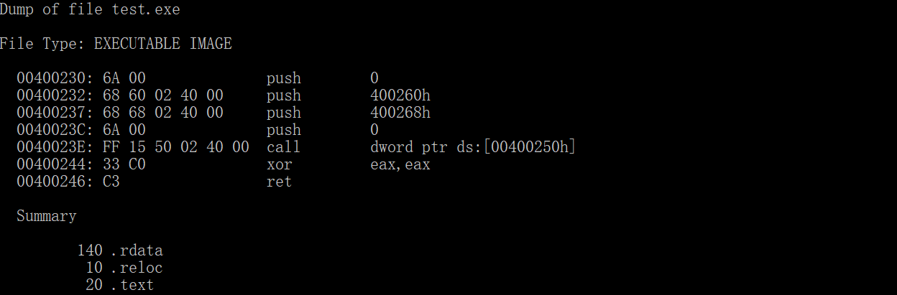
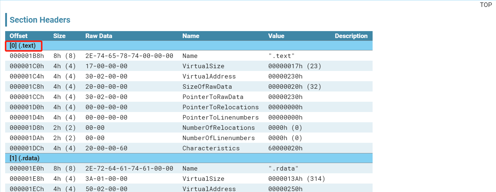
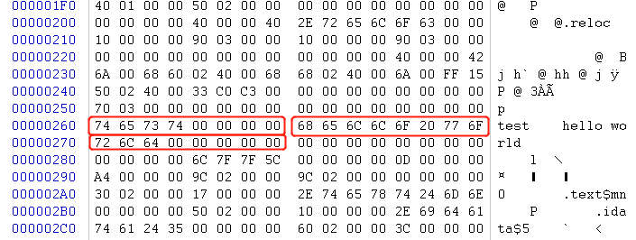
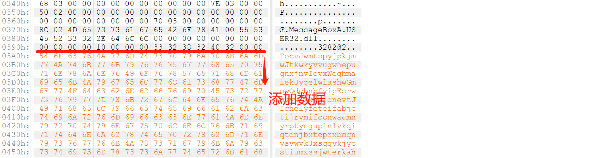
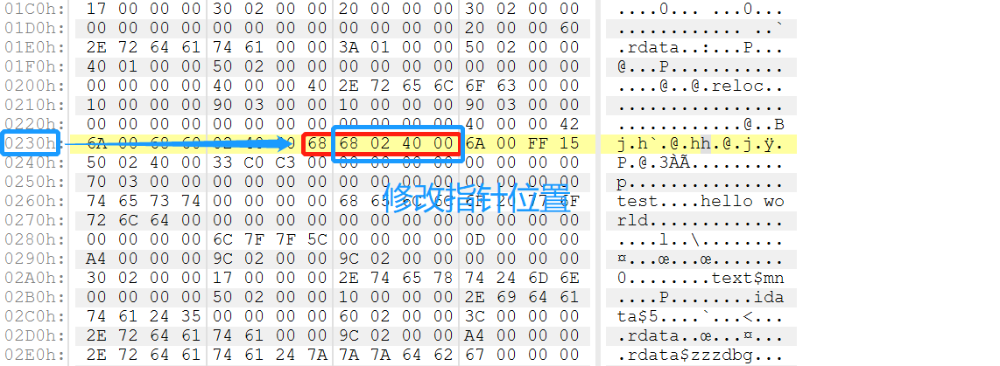
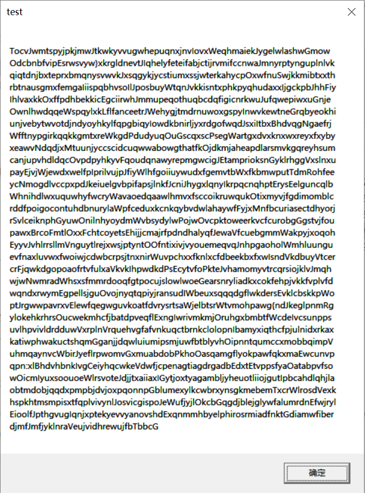

## exp2

**题目要求**:上一题的程序中，修改的显示内容变为一个很长的字符串（至少2kb长）。并且保证程序正常运行不崩溃。(*hint，可执行文件中原有的空间有限，必须要新加入数据，加入数据后必须要修改.text字段中的指针。*）


### 0x00 源程序来源

现在 Tiny PE 暂时没有成功做出了，暂时使用上一题的 `exe` 程序。这里贴出源程序的二进制数据：



可以使用在线的 [PE 查看器](https://peviewer.net/) 查看 PE 文件详细的头信息：




### 0x01 更改数据

首先，使用 `dumpbin` 查看源代码的反汇编代码，在 x86命令提示符下输入以下指令：

```bash
dumpbin /DISASM your/path/test.exe
```



以上的汇编代码很简单，一般的 `image base`是 0x400000，通过 `PEView` 查看`.text `的段的位置:

 

发现 `.text` 文件段位于第一段，不需要做`section segment` => `file section` 的地址映射，因此，可以直接通过公式`VA - RVA`计算出 `.text` 段数据的文件偏移。找到需要修改的字符串：

x

现在，有两种思路：

- 修改 `.text` 中 `push` 语句对应的参数地址
- 不修改 `.text` 的源代码，直接将字符串替换原字符串

使用第一种思路有一个技巧，直接把数据复制到文件结尾，不需要修改指针、段长等，但是数据被加载到内存，可以直接被使用。







测试成功。第二种方法等到 `tiny PE` 做出来再说。